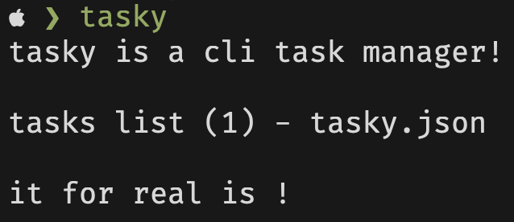

# tasky



#### Feel free to contribute!

### Checkout the [new NeoVim plugin for tasky](https://github.com/fynjirby/tasky.nvim)!

## Install

#### Fastest way 
Just run this command in terminal and it will install everything itself
```sh
curl -L https://sh.fynjirby.dev/tasky | sh
```
or if you prefer GoLang package manager use
```sh
go install github.com/fynjirby/tasky@latest
```
#### Manual way
Go to [releases](https://github.com/Fynjirby/tasky/releases/) and download latest binary for your OS, then move it to `/usr/local/bin/` and enjoy with simple `tasky` in terminal!

## Building
- Install [Go](https://go.dev/) and make sure it's working with `go version`
- Clone repo
- Run `go build` in repo directory, then move it to `/usr/local/bin/`

## How does it work?

When you run `tasky add "text"`, tasky automatically creates tasky.todo file in the current directory and all future work will be with that file until you change the current directory.

When you done a task it just removes from tasky.todo, so you like just drop it

### Why tasky.todo in current dir?

That is probably the best way for working in teams on any projects. You can just add tasky.todo to git repo and it will sync all across your team's computers!

## Usage

`tasky`

-   `add "text"` to add a new task with "text"
-   `done "text"` to make done a task with "text" (terminal regular expressions are allowed - `*` and `?` for now)

-   `help` or `man` to see help message

### Examples of usage

<details> 
<summary>Right here (click)</summary>
  
`tasky add "make some things in new version"` <br>
Will add a task with name of "make some things in new version" <br>
`tasky done "make some things in new version"` <br>
Will make done the task you have just created (it's name is "make some things in new version" if you already forgot 😊) <br>

</details>

## Aliases list

`add`, `put`, `touch`, `new`, `make` - add a new task <br>
`done`, `did`, `rm`, `remove`, `close`, `delete`, `drop` - make task done <br>
`help`, `man`, `-h`, `--help` - see help message

#### note: dont forget that you can add own aliases in your shell's config file (~/.zshrc for zsh, ~/.bashrc for bash, etc)
